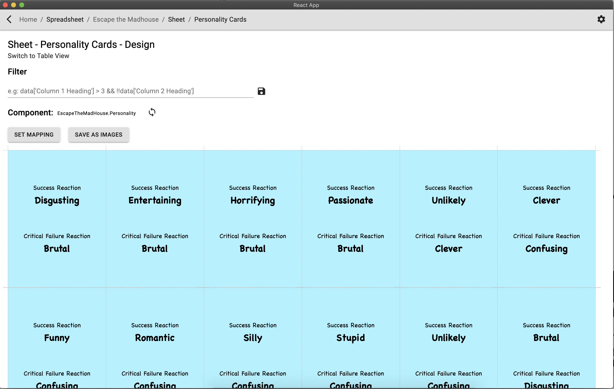

# Board Game Builder

This is a Desktop Application that loads in data from Google Sheets and lets you apply it to various "designs"/React components and then print them out. You can find the source code on [GitHub](https://github.com/cajacko/board-game-builder).

## Next Steps ⏭

- Allow the difference between a sheet being for multiple cards or for a single card
- Make some more generic designs
- Deploy as a stand alone app that still watches and reloads changes from the design directory

## Updates 🔼

### 2020-03-09 - 2020-03-16

Got everything to a proper v1.0.0 state.

- Let you select what component a sheet should use
- Let you map the columns to the expected props from the design
- Improved the UI

### 2020-02-18 - 2020-02-25

Started work on building a way to simplify printing out loads of prototype cards for building board games. This site pulls in data from Google Sheets and can apply each row of data to a specified React component. From there you can just print it out. Also includes a JavaScript filter so you can only print out exactly what you need.
