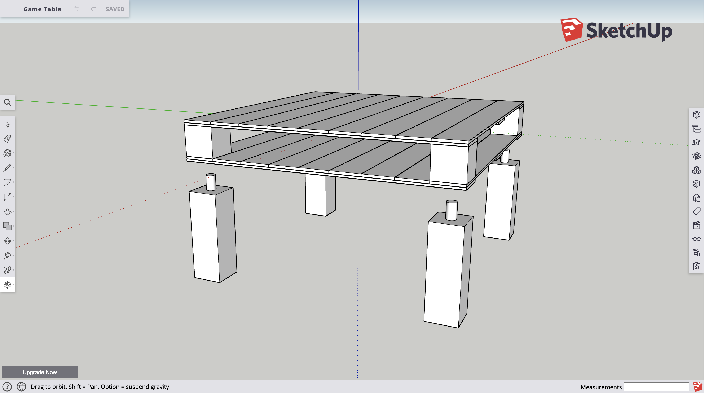

# Board Game Table

I play quite a reasonable amount of board games 🎲♖🙃 Normally on the floor as I like sitting on floor pillows. So I decided to build a funky board game table to improve this experience 👍 This table has 2 surfaces on it, so you can place things like instructions, hand of cards, tokens etc on the bottom layer and leave more room for the shared game info on top.

## Updates 🔼

### 2020-07-11 - 2020-09-05

During the summer I knew I'd have a bit of time off to work on something, so designed and built this desk. The legs screw off so the tabletop can be placed on top of other coffee tops or stored away more conveniently. The colours came from layering up white and blue paint and then sanding/scratching the surfaces repeatedly to get the desired effect.

