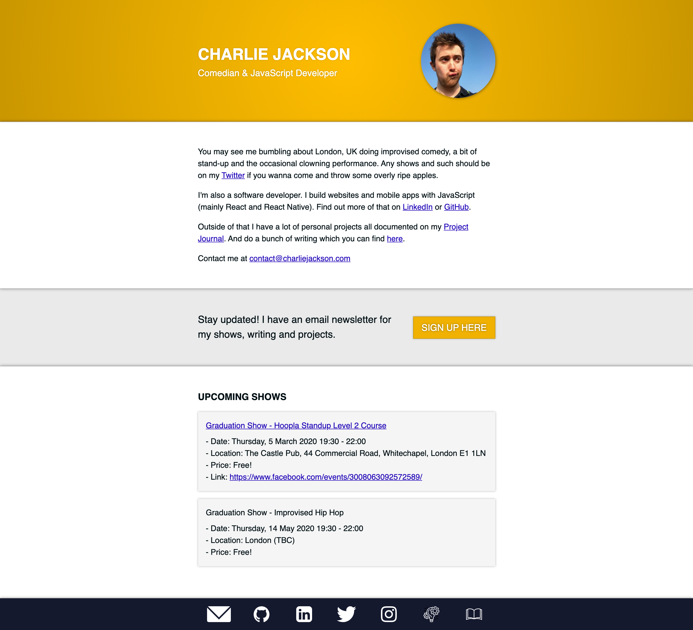

# charliejackson.com

This is my [personal website](https://charliejackson.com) that I tend to use as a landing page to find all my other profiles online and give a little bit of info on what I'm doing right now. Check it out at [charliejackson.com](https://charliejackson.com).

I tend to keep this site super basic. It's not meant to be an example of my coding, more a short intro to me and where you can find out more. You can find the code on [GitHub](https://github.com/cajacko/charlie-jackson-website/).

<!-- ## Next Steps ⏭

Section to explain what to work on next

- [Fill in items here] -->

## Updates 🔼

### 2020-02-10 - 2020-02-17

This redesign was to redesign and add 3 new features:

- Make it easier to update content
- Signup spotlight to my email newsletter
- Showcase my next comedy gigs

For this I did a super basic redesign, using Github pages to serve the site and added in the relevant new spotlights. I also gave the content an update to highlight comedy a bit more.

