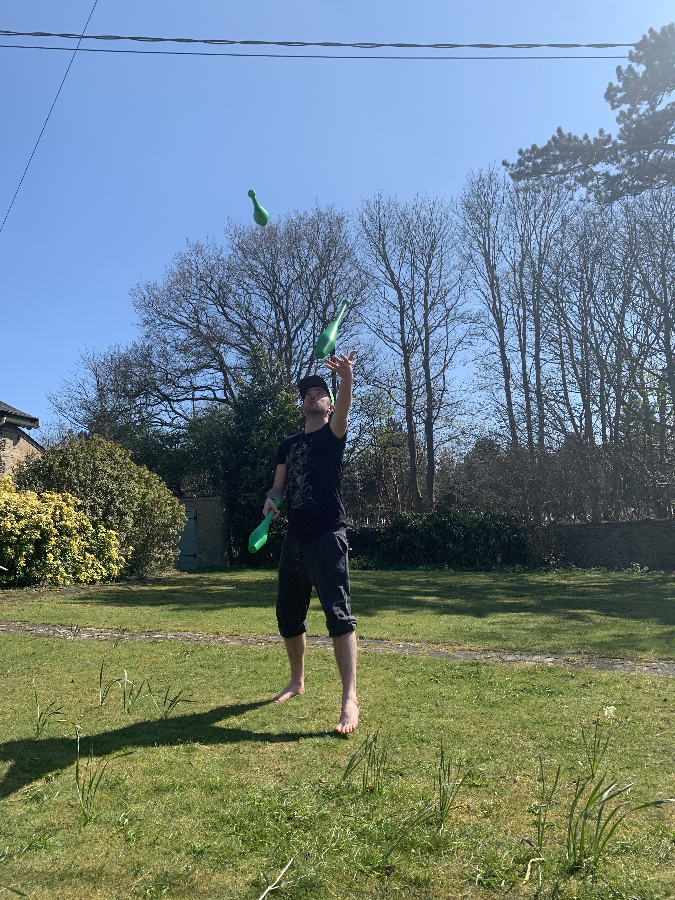

# Circus Skills 🎪

When I was young I really enjoyed practicing various circus skills, every now and then I like to pick them back up again 🤡 Here's some of the stuff I would do:

- Juggling
  - Balls
  - Clubs
- Unicycle
- Poi
- Devil Sticks
- Diablo
- Stilts

## Goals ⏭

Some things I'd like to work towards at some point

- Juggle with 4 and 5 balls
- Juggle comfortably with 3 clubs
- Juggle whilst on the unicycle
- Lean a fun poi routine
- Learn a fun devil sticks routine
- Learn a fun diablo routine

## Updates 🔼

### 2020-04-05 - 2020-04-14

During the coronavirus lockdown it seemed like a good time to get out ye old juggling equipment. Focussing on the being able to consistently do 3 clubs.

