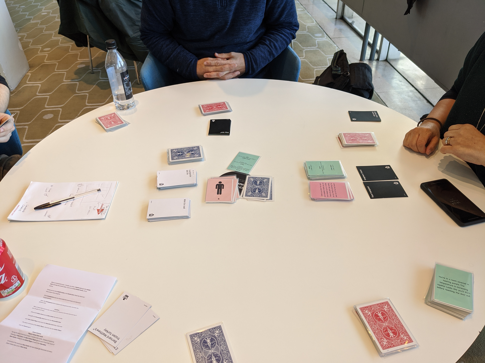
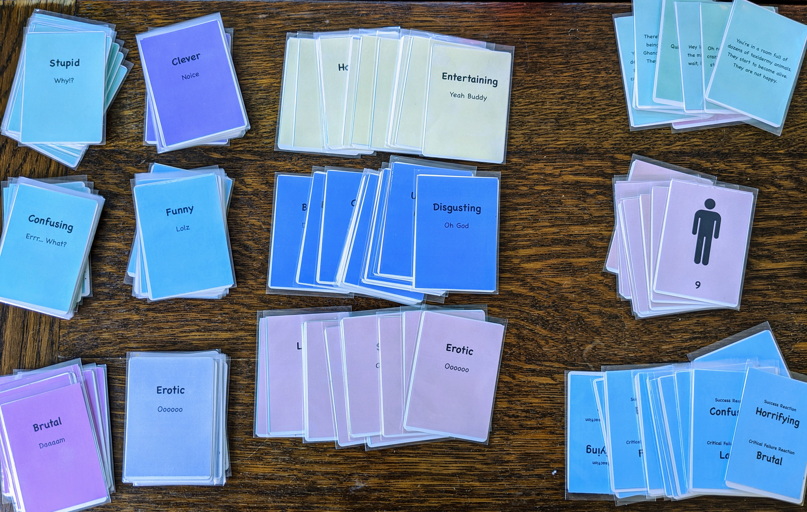
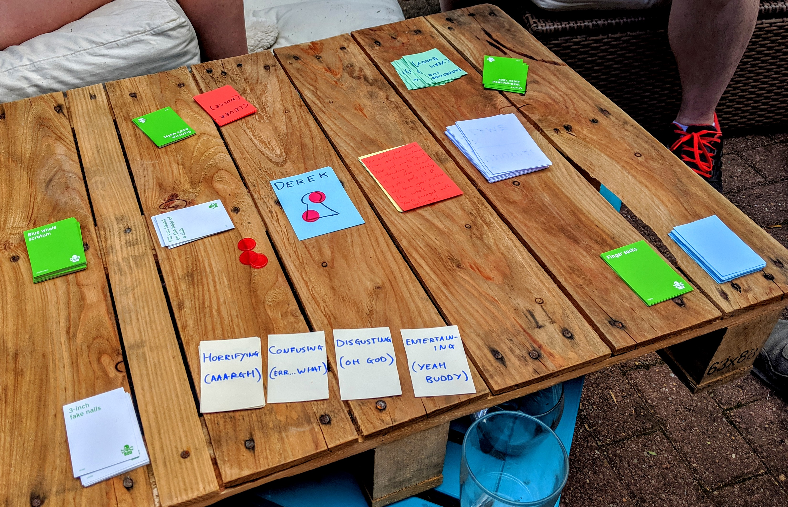

# Escape the Mad House 🏚

A co-operative card game 🃏 of improvised stories and escaping ridiculous situations. Basically a
co-operative version of Bucket of Doom but with a single journey/loose narrative. And a specific end
situation.

Currently in a playable state if you go to the project on
[GitHub](https://github.com/cajacko/escape-the-mad-house) and print/write out the resource cards.
Still very much in a prototype stage, no artwork yet.

## Next Steps ⏭

- More play tests
- Try out some changes to the reaction/personality cards:
  - Remove the lame and erotic
  - Add in romantic and creepy
- Experiment with images (with and without the text) on reaction/personality cards
- Update rules to always draw 2 personality cards and pick 1
- Remove advantages/disadvantages from room cards and instead give disadvantages that effect the way you narrate stories e.g. Narrate in 1 breath
- Ensure every failure removes health
- Adjust the rules so players always choose the item cards for the narrator
- Adjust the flavour text so that Derek wakes up in the madhouse

## Updates 🔼

---

### 2020-01-15 - 2020-01-19

During this time had a great play test and a bunch of things to try out:

- Try out some changes to the reaction/personality cards:
  - Remove the lame and erotic
  - Add in romantic and creepy
- Experiment with images (with and without the text) on reaction/personality cards
- Update rules to always draw 2 personality cards and pick 1
- Remove advantages/disadvantages from room cards and instead give disadvantages that effect the way you narrate stories e.g. Narrate in 1 breath
- Ensure every failure removes health
- Adjust the rules so players always choose the item cards for the narrator
- Adjust the flavour text so that Derek wakes up in the madhouse

#### Media

---

### 2019-12-03 - 2019-12-05

Printed out a new version with more cards so it can be play tested with more people

#### Media 🖼

### 2019-08-05 - 2019-08-18

This sprint was all about getting the basic idea together into a playable state and to start
play testing so we can see what needs to happen next.

#### Goals 🥅

The goals for this first sprint are to get some basic rules and resources up so the game can be play
tested by anyone. And to do a few play tests and refine the rules/resources accordingly.

- [x] Create v0.1.0 of the rules and enough cards for a basic play test
- [x] 1st play test
- [x] Create enough cards for a 4 person play test
- [ ] Do the 4 person play test
- [x] Write up all cards from play test into GitHub so it's all documented
- [x] Write up new rules from play test v0.2.0
- [ ] Play test with v0.2.0
- [ ] Update rules and cards from play test v0.3.0

#### Media 🖼

