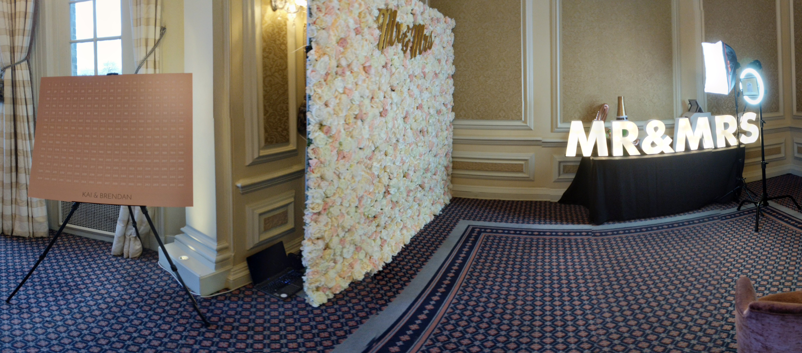

# EventsTag

After working at a big web development agency it was time to go back to startup life. So I joined EventsTag as a JavaScript developer in November 2018. EventsTag was a startup building experiential technology, most of the products revolved around customised photo booths. It was a nice place to work with around 10 of us in the company and working out of the offices for the Ministry of Sound (the Christmas party ws insane 😛).

I worked a lot with React JS, Node JS, Electron and the Internet of Things. During my time here I got involved with building desktop applications that manipulated images and integrated with printers and photos booths. And I started to see the pain of building whith physical products, they break.... a lot. Digital life is so much simpler 😛

I ended up leaving at the end of my probation period in Feb 2018 as I realised I wanted to have a more flexible lifestyle so went into contracting instead.

