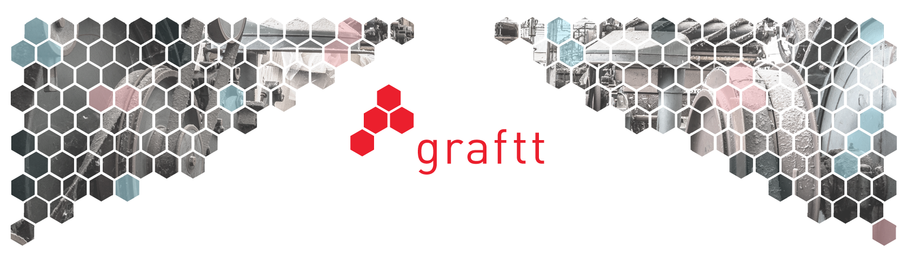
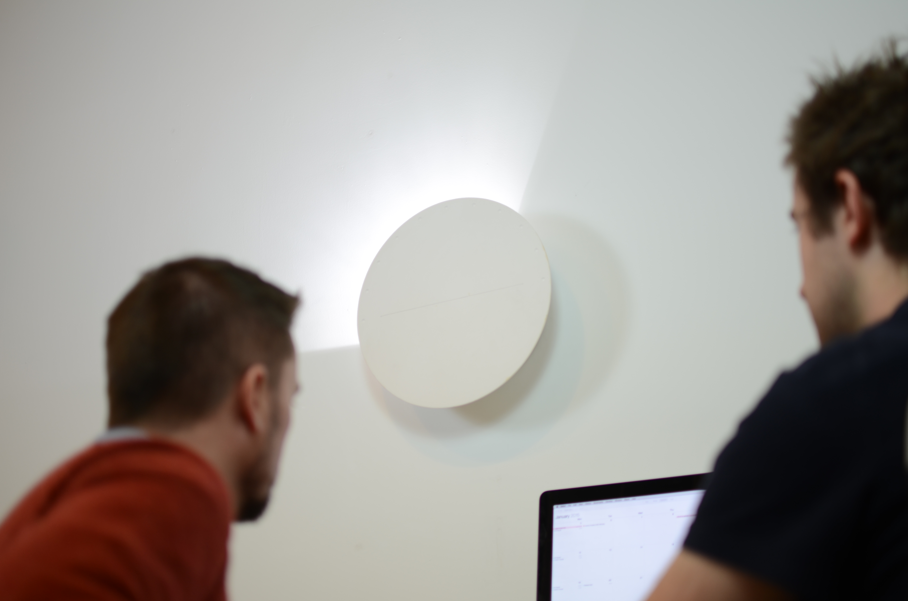
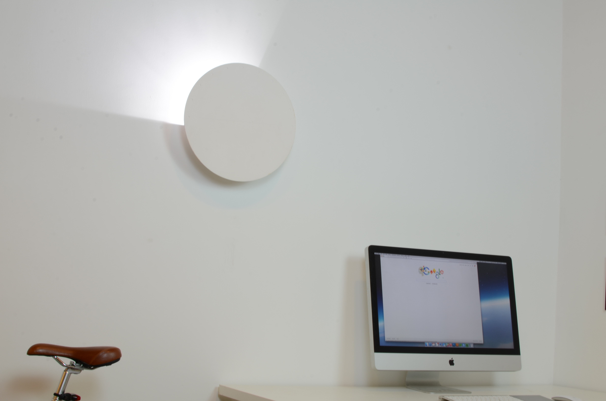

# Graftt

After my [first startup](https://medium.com/projects-by-charlie-jackson/nine-studios-my-tech-startup-9cb36234e17f) crumbled in 2014 it was time to get some sort of job. Managed to come across a startup Internet of Things (IoT) consultancy called Graftt, which sounded perfect given my interest and experience in IoT. Graftt was a very small startup with only 3 of us when I joined in September 2014 and we managed to last doing interesting little projects until it also collapsed in March 2015.

At Graftt I took on the role of Design Officer where I designed and built the IoT devices using a lot of python, PHP and Raspberry Pi’s. I also recorded and produced our podcast (charliejackson.com/productstories), which was a fun experience.

The main product I worked on at this time was called DataLight. A physical light that shone a specific amount of light onto the wall in accordance with the level of a specific piece of tracking data. Basically the light shows you the percentage of a certain metric you set it up to track. When the light is showing 360 degrees the data is 100% if no light is showing it's at 0%.

