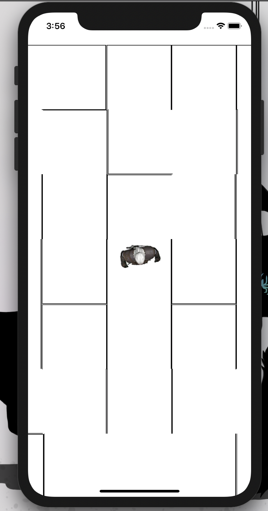

# Hidden Maze 🔀

A game of mazes, not seeing all of them, unlocking doors, fighting monsters and trying to get to the center first.

## Next Steps ⏭

- Ensure you can't walk through the maze walls
- Distribute items in the maze that you can pick up
- Use items to move through wall sections

## Updates 🔼

### 2020-03-09 - 2020-03-16

Spent some time building out the maze idea as an iOS/Android app with React Native:

- Built a control system so you can tap and drag to control direction and speed
- Put and avatar in the middle of the screen who rotates with the direction
- The app generates a random maze on load
- As you move it scrolls the maze behind you

### 2020-02-26 - 2020-03-01

When out for dinner I randomly had the idea for a maze game where multiple players can try and exit the same maze but can't see the whole maze and share resources e.g. keys, monsters etc.

