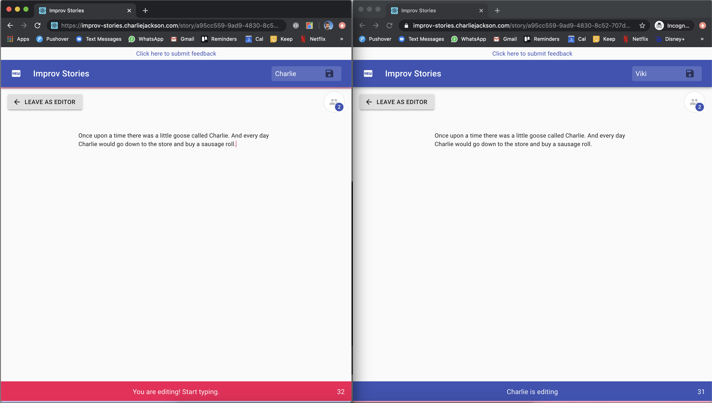

# Improv Stories 📖

[Improv Stories](https://improv-stories.charliejackson.com/) is a digital game where you can write improvised stories in real time with others. It's similar to games like Words with Friends where players take it in turns and have 20 seconds to write the next bit of a story. The app cuts you off when the 20 seconds is up and passes the turn to another player who gets to see your entry before carrying on the story after you.

The site is currently live and working at [https://improv-stories.charliejackson.com/](https://improv-stories.charliejackson.com/). Check it out and let me know your thoughts.

You can view the code on [GitHub](https://github.com/cajacko/improv-stories).

## Updates 🔼

### 2020-04-15 - 2020-05-03

Rebuilt the entire thing, with a focus on just getting something out that works so people can give it a go during Coronavirus lockdown. The current version supports live story writing only.

### 2020-03-17 - 2020-03-21

This was a new reboot where I was playing with GraphQL over sockets and GraphQL subscriptions, which I haven't used before. So less focus on building functionality, more on playing with tech.
