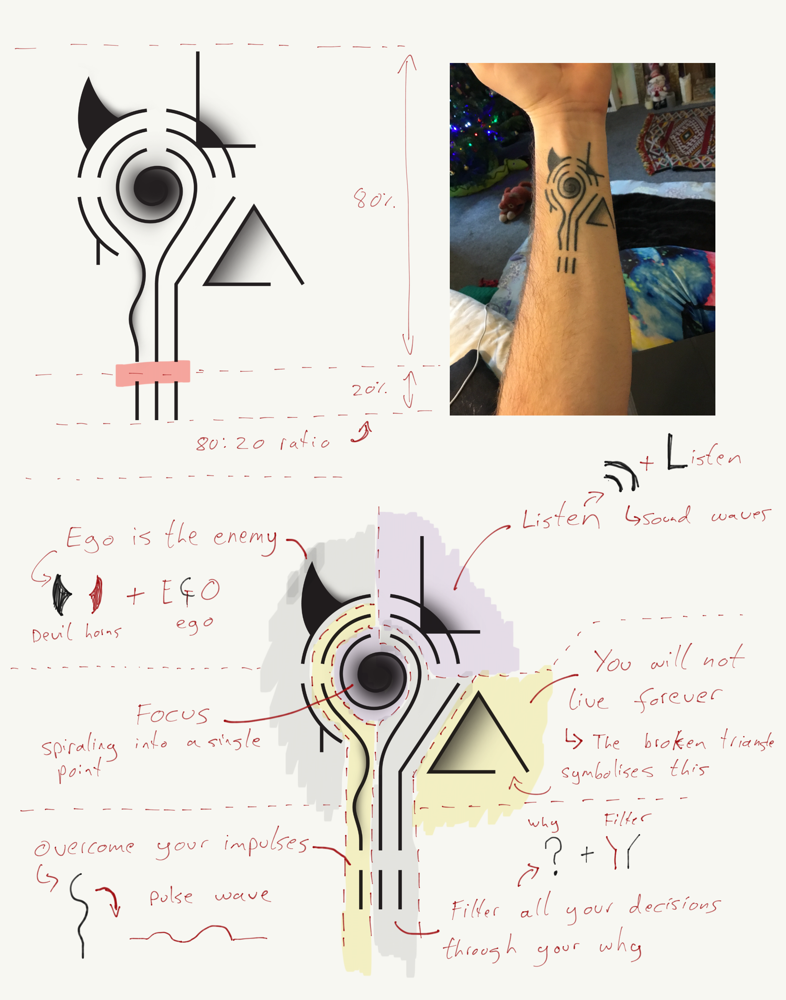

# Mantra Tattoo 🖌

This is my forearm tattoo which is a kind of Aztec/hieroglyphics jumble of symbols. Where each symbol represents a different mantra/quote or lesson I want to remember. Mostly designed by myself with various input along the way.

Here's a list of the current mantra in the tattoo:

- Listen
- You will not live forever
- Focus
- Ego is the enemy
- Overcome your impulses
- Filter all your decisions through your why
- 80:20 rule (Find the 20% of work that counts for 80% of the results, basically be effective not efficient)

And an image describing the images:

## Next Steps ⏭

- Get the phase 2 design tattooed.
- Create a better image explaining both phase 1 and phase 2 designs

## Updates 🔼

---

### 2019-07-01 - 2019-08-30

This was for the phase 2 designs. I got the initial tattoo done in December 2018, so this piece of work was to add a few new mantras to the original:

- Don't be a dick
- Yes and (improv comedy saying)
- Live in the now (mindfulness)
- Rationality (Just a reminder about being rational)
- Enjoy life
- Don't take things too seriously
- Hell yeah or no

Unlike the first phase which was entirely designed by me, I did some initial designs and got some help on 99 designs and then finished it off myself from there.

#### Goals 🥅

- [x] Finish the design for phase 2

#### Media 🖼

