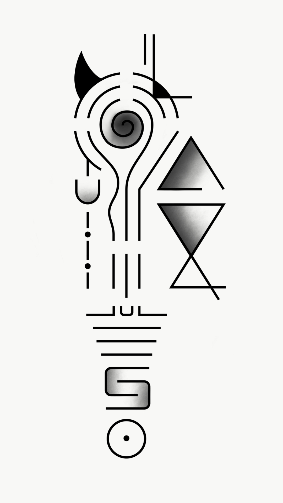

# Mantra Tattoo 🖌

This is my forearm tattoo which is a kind of Aztec/hieroglyphics jumble of symbols. Where each symbol represents a different mantra/quote or lesson I want to remember. Mostly designed by myself with various input along the way.

## Explanation

Here's a guide to each mantra/symbol.

- [1 - Ego is the Enemy](#1---ego-is-the-enemy)
- [2 - Overcome your impulses](#2---overcome-your-impulses)
- [3 - 80:20 ratio](#3---8020-ratio)
- [4 - Focus](#4---focus)
- [5 - Filter all your decisions through your why](#5---filter-all-your-decisions-through-your-why)
- [6 - Listen](#6---listen)
- [7 - You will not live forever](#7---you-will-not-live-forever)
- [8 - Yes And](#8---yes-and)
- [9 - Rationality](#9---rationality)
- [10 - Don't be a dick](#10---dont-be-a-dick)
- [11 - Don't take things too seriously](#11---dont-take-things-too-seriously)
- [12 - Live in the now/mindfulness](#12---live-in-the-nowmindfulness)
- [13 - Hell yeah or no](#13---hell-yeah-or-no)

### 1 - Ego is the Enemy

**Why?**

As an awesome person it's hard to remember that you're not actually as awesome as you think. And thinking you're more awesome than you are has a lot of downsides.

**How:**

The first part of this symbol is the loose form of the letter G from the word "Ego":

Mixed with a devil horn to symbolise enemy:

### 2 - Overcome your impulses

**Why?**

Most of the stupid things we do in life come down to giving into our monkey brain and acting on impulse. Where taking a moment to think a bit beforehand could have been a better idea.

**How:**

This one is shown through a pulse wave for the impulse part:

### 3 - 80:20 ratio

**Why?**

The 80:20 ratio is the idea that with many activities we do, you should be able to find the key 20% of work that accounts for 80% of the progress. We don't always need to do 100% of the activity so this is about being effective with your time, not just efficient. As it's totally possible to be very efficient at doing something that doesn't need doing. This is about being efficient at doing only what needs to be done.

**How:**

At all the points labelled (3) in the image, you can see a break in the artwork. These breaks loosely represent the 80:20 ratio.

### 4 - Focus

**Why?**

I'm notoriously bad at focusing on 1 thing at a time. This is to remind me to stay focussed.

**How:**

The spiral going inwards represents focus.

### 5 - Filter all your decisions through your why

**Why?**

Whatever purpose(s) and goals you have in life, every decision you make should be in service of 1 or more of those goals. Otherwise why are you doing it?

**How:**

This one is made of 2 parts. The question mark, symbolising why:

And 1 half of a filter flask to show the filter part of the mantra.

### 6 - Listen

**Why?**

One of the best ways to improve your relationships is to simply listen to the other person. It's all too easy to be thinking of what to say next, or commenting in your mind, rather than actively listening and absorbing what the other person is saying and doing. It's a lesson from improv comedy that I find super important in life.

**How:**

The first part of this is the letter L from "Listen"

The next part is audio waves.

### 7 - You will not live forever

**Why?**

I don't particularly want to die, and kinda feel like I'll live forever. This is a reminder that it is not at all likely.

**How:**

A broken triangle, showing that it does carry on forever.

### 8 - Yes And

**Why?**

"Yes And" is one of the core principle in improv comedy, which I've done quite a bit of. It's about agreeing and building stuff together. The ideas can be taking into real life and I've found them super useful for improving relationships and having more fun with folk.

**How:**

The letter Y:

The letter E:

The letter S:

And finally and ampersand "&":

### 9 - Rationality

**Why?**

"Harry Potter and the Methods of Rationality" is my favourite Harry Potter book, and an amazing fan fiction. It explains a lot of great concepts about rationality and taught me loads. So this is a reminder of that.

**How:**

This part of the tattoo is meant to loosely represent the Elder Wand from Harry Potter. If you see the depictions of it from the films you can see the loose resemblance.

### 10 - Don't be a dick

**Why?**

Rule no 1. Don't be a dick.

**How:**

Get it?

### 11 - Don't take things too seriously

**Why?**

Why have a serious life when you can laugh at everything?

**How:**

It's a face shrugging its shoulders. Kinda like it's going why not?

### 12 - Live in the now/mindfulness

**Why?**

Mindfulness and meditation get a lot of things right. Focusing on the moment rather than the past or present has helped me be happier. I don't want to forget.

**How:**

This whole piece and the circle at the bottom forms a giant exclamation mark, for now!

### 13 - Hell yeah or no

**Why?**

There's so many amazing things to do with your time, if you have too much choice sometimes if your response isn't "Hell Yeah" maybe it should be "No.

**How:**

The devil horn stands for "Hell"

The 2 vertical lines are an "OR" symbol in JavaScript

## Updates 🔼

---

### 2019-09-09 - 2019-09-09

Got the 2nd phase design tattooed. 

### 2019-07-01 - 2019-08-30

This was for the phase 2 designs. I got the initial tattoo done in December 2018, so this piece of work was to add a few new mantras to the original:

- Don't be a dick
- Yes and (improv comedy saying)
- Live in the now (mindfulness)
- Rationality (Just a reminder about being rational)
- Enjoy life
- Don't take things too seriously
- Hell yeah or no

Unlike the first phase which was entirely designed by me, I did some initial designs and got some help on 99 designs and then finished it off myself from there.

#### Goals 🥅

- [x] Finish the design for phase 2

#### Media 🖼

