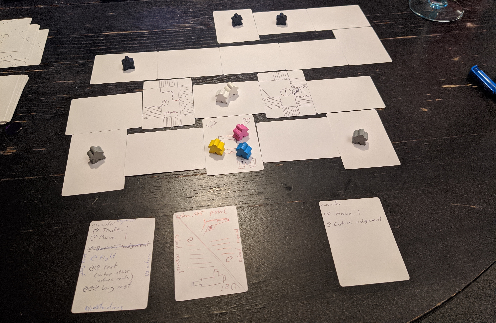

# Mini Strategy

The idea of this board game is to build a dungeon crawler style strategy game that can fit in your pocket and be taken to the pub. Here's a list of the restrictions:

- Co op game
- Can fit in a large pocket or handbag
- Involves moving characters around a map, defeating enemies becoming more powerful and accomplishing objectives

## Next Steps ⏭

- Keep having an explore and try and nail down a few more mechanics.
- Keep building 1 small scenario and all the mechanics needed to play that

## Updates 🔼

### 2020-02-03 - 2020-02-09

Had the first brainstorming/prototyping session. Took a deck of blank cards, some meeple, d6 and coloured tokens and had a play with:

- Laying out cards as the map
- Having location cards that you need to activate in app to move through e.g. security doors, lasers, broken stairs etc
- Using tokens as locked doors, objectives and in app activated events
- Letting the character card and cards in your hand dictate the action you can do. By tapping them when used.

The idea at this stage was that the game could function like a micro version of Mansions of Madness. You have a companion app on the phone where you pick a scenario, read a bit of narrative and layout the initial cards for the map, your character etc. As you play the game you interact with the app to discover new parts of the map, enemies, solve in app puzzles and get drip fed more narrative about what is happening.

One of the ideas for a theme was "Expose MegaCorp". Where MegaCorp is a huge evil organisation that does illegal tech and bio-weapon research. It's your job to infiltrate and find evidence of their illegal activities. But as a very wealthy company they have top of the line security you must try and get past, and their bio engineering experiments have led to some disastrous enemy creations. Luckily you can make use of some of the stuff you find, like strength serums, high tech weapons etc.

