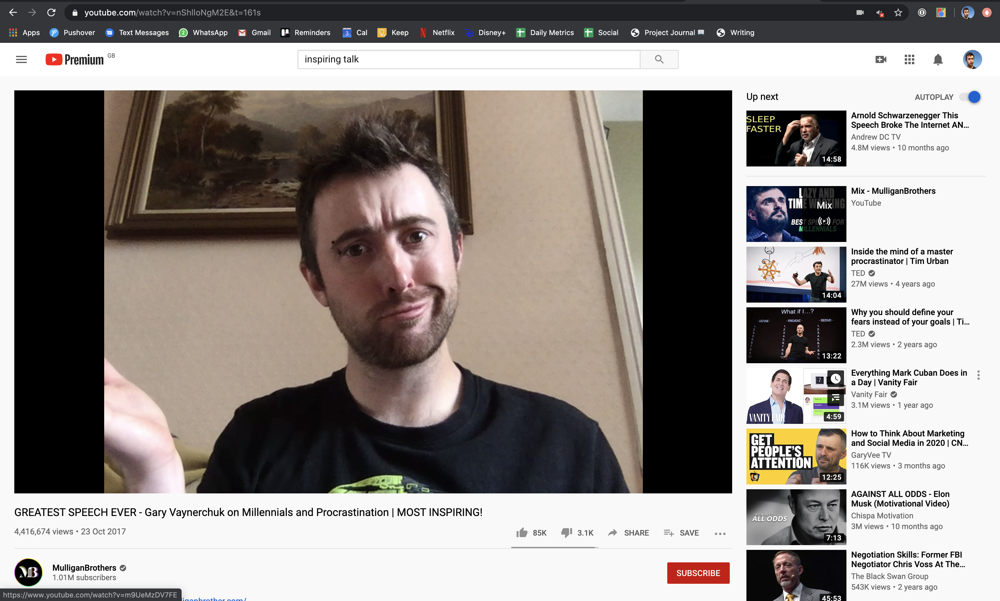

# Online Performing Tools 🕴

During Coronavirus the comedy scene went online and got very experimental. This project is about the online performing tools I've built. You can view the project repo [here on GitHub](https://github.com/cajacko/online-performing-tools). At the moment it has the following tools:

- Replace with video extension (A chrome extension that replaces YouTube videos with your camera feed)

## Updates 🔼

### 2020-04-15 - 2020-05-03

Built a working version of the "Replace with video extension" tool. It works! Here's the description:

A chrome extension that replaces any YouTube videos that are playing with your camera feed. The performing idea is that you would be live sharing your screen and going through YouTube videos based on comment suggestions from your audience, kinda GoggleBox style. But every YouTube video you go to will instead show your camera feed, so you as the improviser will improvise the content of that YouTube video.

