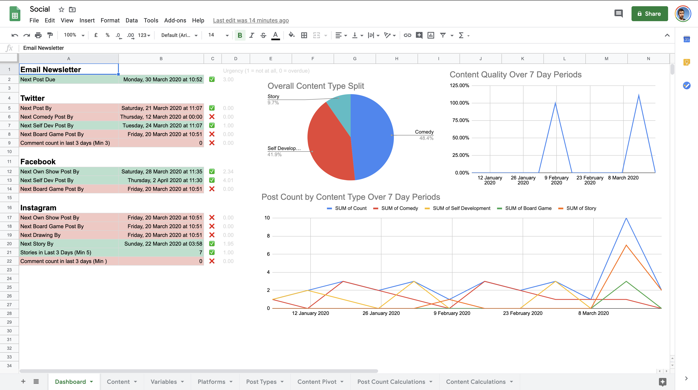

# Social Dashboard 📱

Social Dashboard is a new way I've been trying to motivate myself to post more ane better content on social media. It's a Google Sheet where I input all the posts I've done and a dashboard shows me what kind of things I should be posting next, my content split and whether I'm doing enough good content. Ideally I'd be looking at performance goals rather than these internal ones, but I need to start a habit of posting first.

## Updates 🔼

### 2020-03-17 - 2020-03-21

Built the first version of this sheet:

