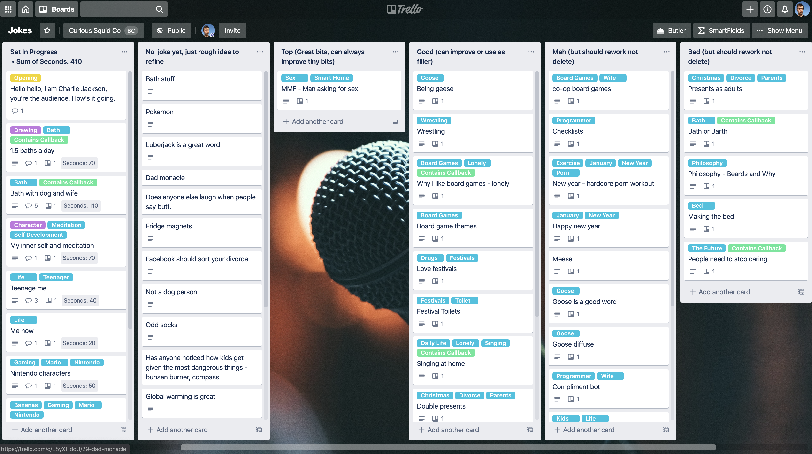
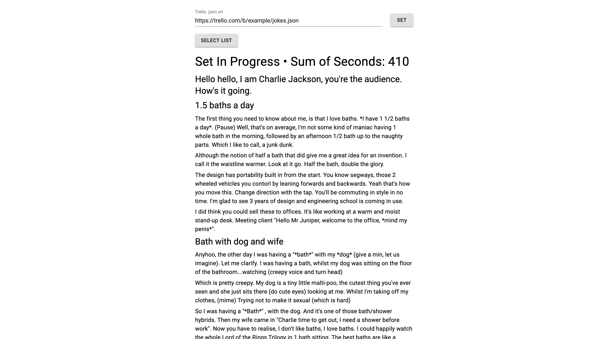

# Stand-up Viewer

Stand-up viewer is a simple web app I built to help me organise and practice stand-up sets and jokes. I've been using Trello to organise my bits and write the Joke content into the description. However it is then pretty awkward to go through a new set all in one go, as I haven't remembered all the content yet. The web app looks at the Trello board and displays the title and description of everything in the selected list in 1 scrollable page. So it's easy to practice.

You can find the code here on GitHub: https://github.com/cajacko/stand-up-viewer

You can use it as well. Just visit https://cajacko.github.io/stand-up-viewer/ and put in the .json url to your Trello board (The normal url to your trello board with .json on the end). The board must be set to public.

## Updates 🔼

### 2020-03-02 - 2020-03-08

Built the first basic version:

