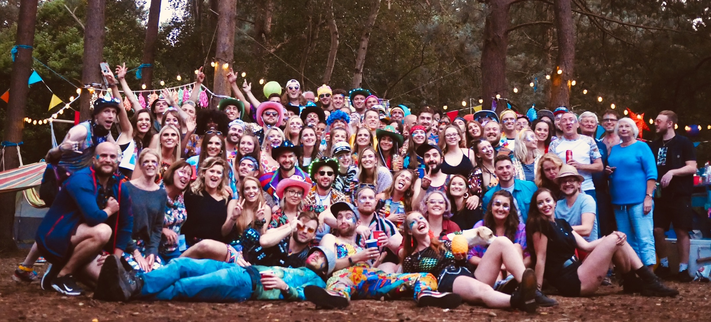
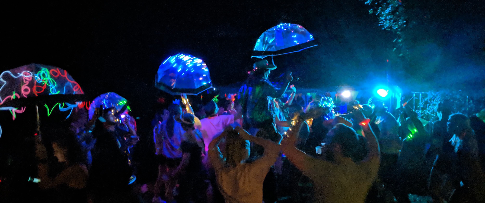

# The Wood Party 🌲🔥🥳

The Wood Party is an annual party/rave/festival ⛺️ put on by [me](https://charliejackson.com/), [India Jackson](https://www.indiajackson.co.uk/) and [Viki Jackson](https://vikibell.com/). Set in the woods 🌲, it's a multi-day event of dancing 👯‍♀️, drinking 🍻 and crazy activities and decoration 🎊. We started it in 2010 and each year keeps getting bigger and better. With more time spent on building fun decorations, outfits 🎩 and bars. Hence why it deserves a place in my project journal 🙃

## Updates 🔼

---

### 2019-06-14 - 2019-08-18

The Wood Part year 9! This year we focussed on building a whole set of bars and furniture ⑁. Using reclaimed pallets, painting 🎨 them fun colours and building/assembling them into bars and seating.

We also saw the return of the giant balloons 🎈, hammocks, fire dancing 🔥, jellyfish umbrellas ☂️ and glitter station. We tried out some new festoon lighting 💡 which worked super well and a bubble machine 🧼!

This was the first year with a threat of rain 🌧, so we prepped with high hanging sails and extra marquees. Turned out it only rained on the Friday so the main day on Saturday went along smoothly.

I also spent a good few hours weaving strip lights 💡 into a black fishnet jacket for my evening attire.

#### Media 🖼

