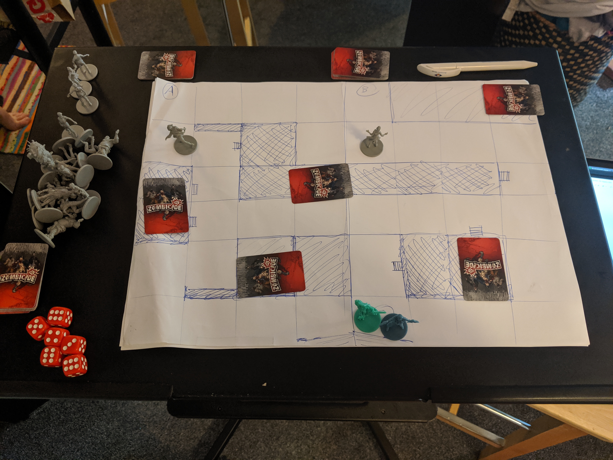
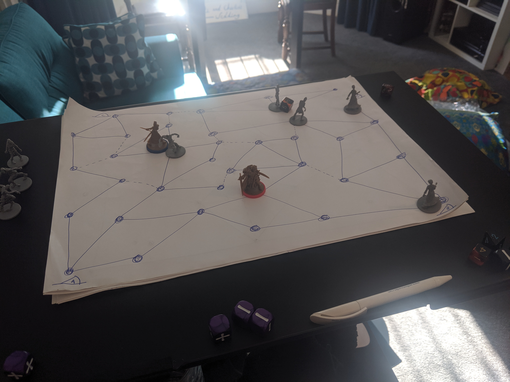

# Vigilantes 🦹‍♂️

Vigilantes is a co-operative board game where players get to start as normal people trying to make the city a better place. As you play you gain abilities and gadgets to turn you into a super hero 🦹‍♂️. Theses changes persist between playing sessions. Unfortunately the villains 😈 you play against also improve over time and the locations in the city you play on start getting destroyed by the villains and their henchmen.

You can find the project [here on GitHub](https://github.com/cajacko/vigilantes).

## Next Steps ⏭

Section to explain what to work on next

- Strip back the first version of the rule set, to something that can be played without legacy components. Then play test it.
- Start adding in legacy elements
- Write a bunch of resource cards so it can be played

## Updates 🔼

---

### 2019-09-10 - 2019-10-04

The was the first sprint on this project and was focussed on refining my ideas about the game and presenting a basic rule set that can be further simplified and play tested.

#### Goals 🥅

- [ ] Have a super simple playable version focussed on the core concepts
- [x] Write up the initial rule set
- [x] Write up a comprehensive set up ordered uncertainties and next steps

#### Media

