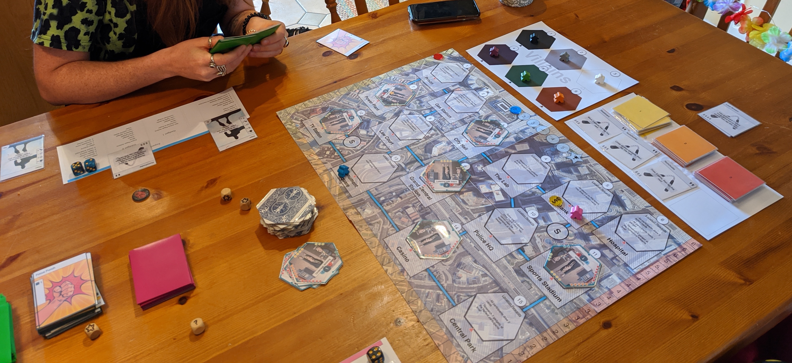
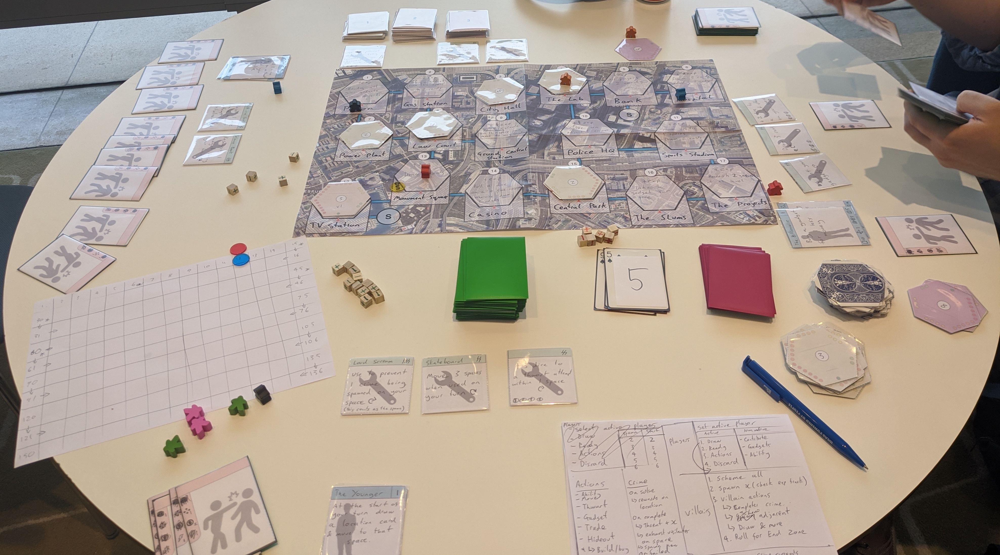
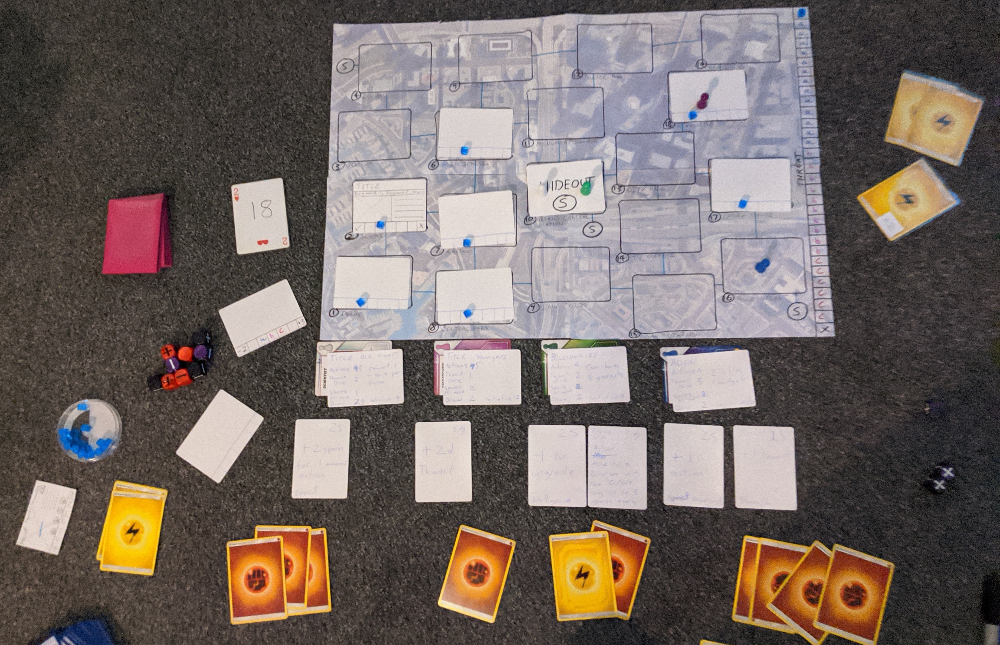
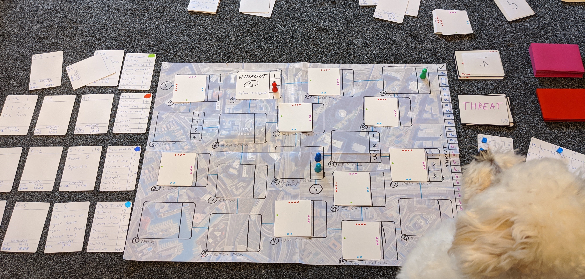
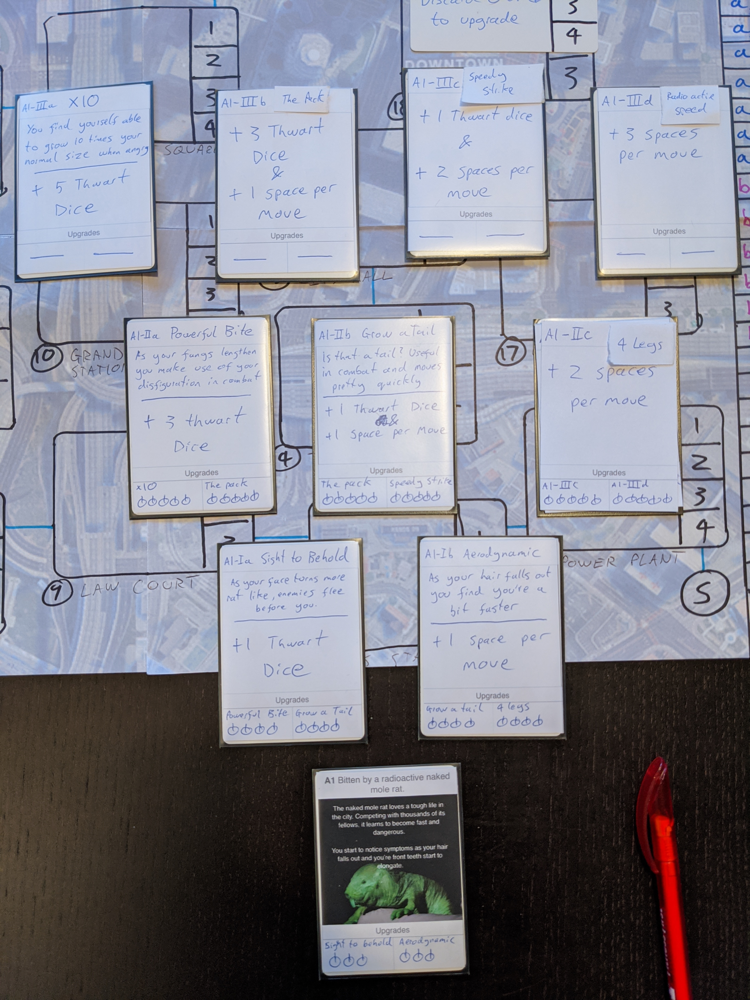
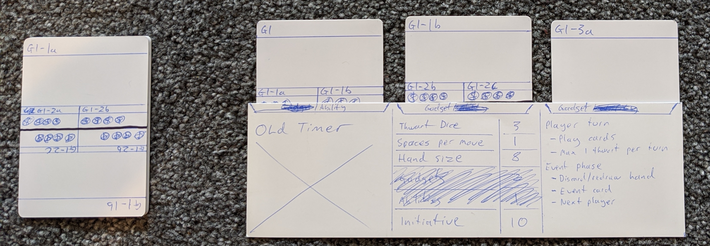

# Zero to Hero 🦸‍♂️

A board game where players start as a normal person and by the end of the game have levelled up to a full on superhero through tackling crime and villains.

## Next Steps ⏭

- Get more named cards/images
- Keep playing through the current version
- Figure out available gadget process, feels clunky and not as exciting as it could be
- Figure out the threat track, good end values, does the roll system work etc.

## Updates 🔼

### 2020-03-21 - 2020-03-28

Worked on getting a fully printed version based off the data in Google Sheets so I can more easily keep track of the changes and have a nicer version to play test.

### 2020-03-09 - 2020-03-16

Implemented the idea of having action dice. This didn't work. It was more fun to have action cards that could only be spent once but could do multiple things, rather than dice which only shows 1 kind of action, or you can change to anything. It's also easier to wrap more theme into cards.

Played with another version with the following changes:

- Players get individual experience which goes towards upgrading their vigilante
- There's a victory track. You win if you get to the end. You collect victory points by thwarting any crime/villain card that has a victory symbol on it. This track also controls the number of crimes and intensity to spawn at.
- Crimes have a separate number of experience and threat, no longer the same as the target thwart value
- Villains are shuffled into the crime deck and can be spawned any time after the first 1/2 spawns. This is done by having 5 crime types:
  - Starting crimes
  - Level 1 - 1 villain shuffled in here
  - Level 2 - 2 villains shuffled in here
  - Level 3 - 3 villains shuffled in here
  - Level 4 - enough high level cards to ensure the game ends (don't like the idea of losing if the deck runs out, and reshuffling crimes will be awkward as they'll get mixed with lower levels)

### 2020-03-02 - 2020-03-08

Played around with some ideas about removing the action cards and replacing them with tokens or dice. Seeing as the cards were only used to make you think about what actions to take and determine available actions, it seems like there's a simpler and tidier way by using tokens or rolling dice to determine this.

The current idea is that you start the game with x amount of action dice per player. At the end of your turn these move to the unused pool. You can spend them (by moving into the used pool) in the following ways:

- Add them to a thwart attempt, and then roll them
- Spend any 1 to move up to your allowance
- Spend x and roll them to gain resources either money or charge
- Spend x dice to trade with anyone on your space

The dice would be coloured per player so when you contribute dice to a thwart attempt and a single player rolls you know whose dice is whose. This then allows us to reward players with more dice as rewards or upgrades. You would also now have more control over the actions you can take, as you can take any combination of move/thwart/trade/resource generation rather than drawing a random mix from the action cards.

### 2020-02-26 - 2020-03-01

Built a new version with hex crimes and a lot of the changes from the last update. Had a play test of this version which went really well. Here's some of the notes from it:

- Definitely don't want additional effects on action cards. So can we reduce them to tokens or dice? Then much easier to glance at, organise, discard (or not discard, can re roll?)
- Actions should refresh at the end of your turn so you always have actions to spend on other peoples turns, but if you do that means you can't use those actions in your turn
- There needs to be more ways of helping each other, or moving people with you/onto your space
- The s marks could be subways instead of sewers
- Need the villains to appear sooner but not immediately
- Have a max dice limit (15 is what we had and worked quite well), this may force people to use the chance dice and balance their abilities so their not just lots of dice but also convert and reroll
- Have the gadget limit on the vigilante card
- Get rid of any abilities that are "at the start of your turn do this" too easy to forget
- We didn't replace crimes when they completed, should play test this properly
- At the moment the experience track only does bad things: determines number of crimes and their starting level. Makes more sense to have it controlling upgrades and spawning villains, unless there's a better way to do all this.
- Have bigger rewards for defeating villains atm it's just upgrade. Be good to draw more actions as well and tend to use all of them to defeat them.
- Do not have action cards with only 1 symbol
- Researching new gadgets cost too much, around 6 cards atm
- Start with some gadgets to buy in the hideout
- Convert all is too powerful, make it a 1 use gadget
- More 1 use gadgets
- Is was mentioned that we could separate one use gadgets and normal ones. Not sure about that though.

From this we've got a few new ideas to play with:

- Tokens instead of action cards, still draw them and discard and each token may still have a mix of symbols but you have to pick 1
- Action dice instead of action cards. The dice have things like +1 thwart dice, 1 money, 1 charge, move. You roll at the end of your turn and move them from an unused to used pool on your reference sheet. Similar to Dead of Winter. If we do this we may need some way of changing/choosing the action die result so you don't end up with all movement and nothing else. Or could have different actions on different dice. You can also get more as you upgrade.
- Allow people to use any of their actions during other peoples turns, but they can't initiate a thwart, just contribute. So can move together to do things

### 2020-02-18 - 2020-02-25

This week I was looking at simplification, self balancing and player interaction. So have been testing the following ideas:

- Getting rid of ability cards in favour of more gadgets, which can be bought/upgraded and traded - This gives you more control on what abilities you want your vigilante to have
- Having an upgradable character instead of the ability cards to add to the thematic flavour (e.g. fun abilities) and making characters more unique
- Removed location cards and added the rewards to the map - reduces number of cards and you don't need to worry about shifting cards too often
- Removed individual crime consequences in favour of a uniform consequence - So face down crimes are now unknown
- Starting character and gadgets work in a draw x keep y method - Again to improve flexibility in picking what your vigilante is like
- Gadget cards improve as characters level up - To improve from a thematic point of view and reward you
- Crimes get more intense as you progress - To improve from a thematic point of view
- When the threat track reaches the end you start rolling dice to see if you've lost. This is to ensure there's always a chance to win the game, you can't get to a situation where you are guaranteed to lose.
- You can decide to add chance dice to any thwart attempt, which have 1 + side but also a V (villain) side which solves the crime if it comes up. This means you can always push your luck to try and defeat a crime. You can never not try.
- There are more opportunities to do things during other players turns (use gadgets, contribute action cards)
- To succeed on any thwart you must roll x amount of + results, if you fail the crime schemes 1
- Villains have uniform actions and consequences. But different hit values and rewards. You rotate the cards to show damage
- You can research better gadgets at the hideout, by spending any amount of cards to draw new gadgets at your current level
- All crimes scheme during the villain phase
- Experience still determines number of crimes to spawn
- You upgrade you vigilante as soon as a villain is defeated
- Villains spawn the first time you spot a v1, v2 or v3 icon on a crime card

---

### 2020-02-10 - 2020-02-17

Here I've been trying to figure out how to make the spread of gadgets/abilities more balanced and personal, so players feel like they can become the hero they want, and don't get stuck with effects they don't enjoy. So here's some ideas I've been playing with:

- Draft initial abilities/gadgets
- Have a selection of gadgets available to "buy" at the hideout. You don't upgrade gadgets, instead the ones available to buy get better over time. Allowing you to make up for a bad draw of character and ability(ies).

I've also been looking at core mechanics as well such as:

- Whether to always have 6 dice, and upgrade the dice as you progress
- Must discard x action cards to do a thwart, doesn't matter what's on it. (Whilst keeping the initial way of adding dice to thwarts)

---

### 2020-01-13 - 2020-02-09

During this time I was working towards building a version that could actually be play tested with people. Here's a summary of the game at the end of this period:

Zero to Hero is a co-op game of building your character from a normal person to a fully fledged super hero. By battling harder crimes and villains you can level up your gadgets and abilities to create the hero you want. The game creates a randomised city for you each time you play and crimes will keep getting spawned and get closer towards being successful. Each player uses action cards to move around the board, upgrade gadgets/abilities and increase their chances of thwarting crime. The heroes are successful when they have successfully defeated 3 villains. They lose when the Threat level has increased too much (this happens when crimes succeed and villains get an action).

I managed to have a few play testable version of this and had a great session at a play test meetup.

Here's some key takeaways:

- Locations used to be fixed on the board, now they are cards to distribute randomly at the start of the game
- The rewards for solving a crime are specified on the back of the location card the crime was on. Giving a unique flavour to each crime you solve
- Negative consequences for crimes completing are on the back of the crime card, giving a similar flavour to the rewards
- Gadget/ability cards used to have a resonable sized upgrade tree and each was a separate card. Now all upgrades for a gadget/ability fit on 1 card. (By using half a card and the front/back to have 4 different versions)
- Character cards are long and let you slot in gadget/ability cards so you can easily see what's active
- Players draw and play action cards to do things like move, upgrade, increase chances of thwarting a crime
- Crimes and villain actions are triggered in an event phase after each players turn, similar to Pandemic
- Early versions did result in a lot of dice being used, which isn't great UX
- Fate dice were being used where a + counts as a success and a - could be converted into a + by some card effects
- There have been issues with the way thwarting occurs, tried having a set number of turns, action cards that allow thwarting and thwart tokens that each character has. None of these methods quite work yet
- At the moment the difficulty of crimes and villains increases over time, but not the title of crimes or consequences of crimes succeeding. Which doesn't make it feel like the seriousness is scaling
- Crime cards rotate when they are getting nearer to being completed, leading to a nice visual way of seeing which crimes are closer
- Action cards may specify an amount of resources they give when discarded. This resources are used to upgrade gadgets/abilities
- Solving a crime increases the experience track, crimes succeeding increases the threat track. The experience track helps to decide how difficult the crimes should be, the threat track gives an end game condition

